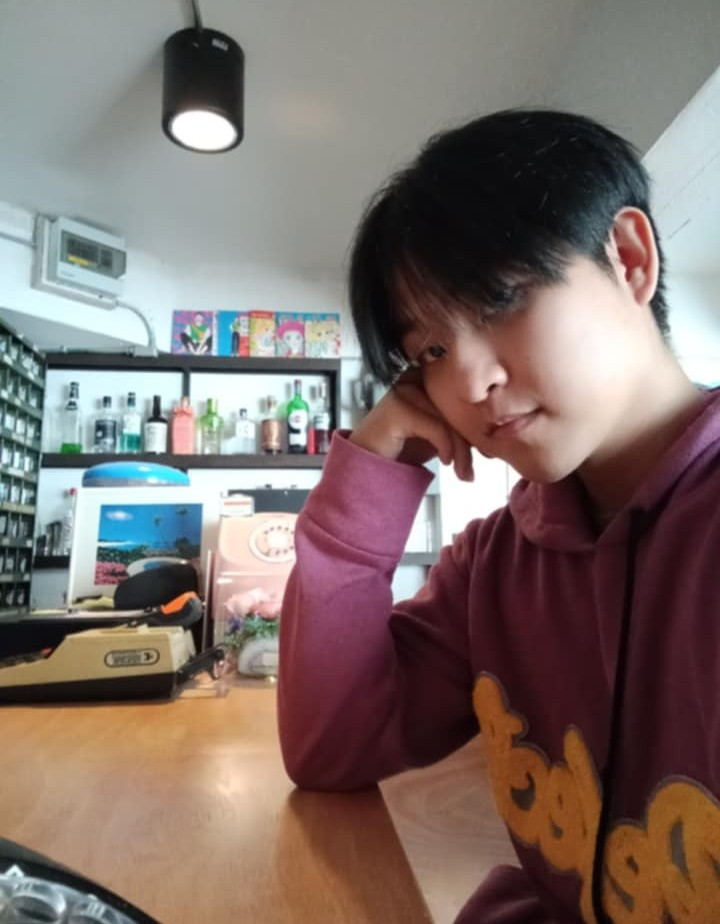

  
   
  <b> Hi, I'm Kitnupong-Rujileath 👋</b> 
  <b>💻 IT Student | Aspiring Software Developer | Lifelong Learner</b>

---

## 👩‍💻 About Me
- 🎓 I'm currently studying **Information Technology at Maejo University**  
- 🌱 Currently learning **React, Spring Boot, and Python for Web Development**  
- 💡 Passionate about **Programming, Database Design, and Software Projects**  
- 🤝 Looking to collaborate on **open-source or university projects**  
- 📫 Reach me at: **nice19274@gmail.com**

---

## 🛠 Tech Stack & Tools
| Domain            | Primary                  | Comfortable            | Currently Exploring   |
|-------------------|--------------------------|------------------------|-----------------------|
| **Web Dev**       | HTML, CSS, JavaScript    | React, Bootstrap       | Spring Boot, JSP      |
| **Programming**   | Python, Java             | SQL, PL/SQL            | Node.js               |
| **Database**      | MySQL, Oracle SQL        | Database Design (3NF)  | MongoDB               |
| **Tools**         | Git/GitHub, VS Code      | Eclipse, IntelliJ      | Docker, Maven         |

---

## 🚀 Featured Projects
| Project                | Type                          | Highlights |
|-------------------------|-------------------------------|------------|
| **ITSCI Book Center**   | Web App (Spring MVC + Hibernate) | Online bookstore with cart & checkout |
| **ITSci Noodle Shop**   | React + Bootstrap App         | Food ordering system with responsive UI |
| **Lottery Sales DB**    | Oracle SQL / PL-SQL           | Database schema with triggers & functions |

---

## 📝 Recent Activities
- 🔖 Learning **Robot Framework** for automated testing  
- 📚 Exploring **AI in Financial Planning** for student projects  

---

## 📞 Let’s Connect
- ✉️ Email: nice19274@gmail.com  
- 🌐 GitHub:   

---

⭐ *“Great things are built by continuous learning and teamwork.”*  
